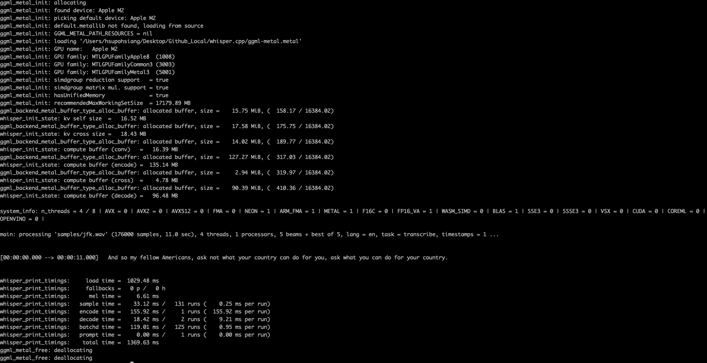
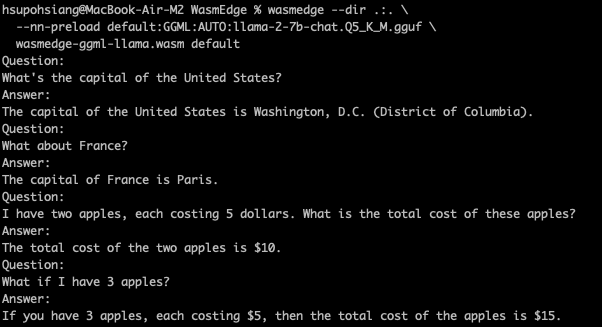

# LFX-Mentorship-Proposal-3170

## OutLine

[toc]

## About

This is a repository of LFX pretest

## Enviroment

- Macbook Air 2022
- CPU: M2
- RAM: 24GB
- MacOS: 14.3.1

## whisper.cpp

1. Clone the repository

```bash
git clone https://github.com/ggerganov/whisper.cpp.git
```

2. download the whisper models

```bash
bash ./models/download-ggml-model.sh base.en
```

3. build the main example

```bash
make
```

4. test the audio

```bash
./main -f samples/jfk.wav
```



## Build WasmEdge with WASI-NN llama.cpp Backend

1. Clone the repository from the github, and use the specific version

```bash
git clone https://github.com/WasmEdge/WasmEdge.git
cd WasmEdge
git checkout hydai/0.13.5_ggml_lts
```

2. Install the dependencies

```bash
brew install cmake ninja llvm
export LLVM_DIR="$(brew --prefix)/opt/llvm/lib/cmake"
export CC=clang
export CXX=clang++
```

3. Build WasmEdge

```bash
cmake -GNinja -Bbuild -DCMAKE_BUILD_TYPE=Release \
  -DWASMEDGE_PLUGIN_WASI_NN_BACKEND="GGML" \
  -DWASMEDGE_PLUGIN_WASI_NN_GGML_LLAMA_METAL=ON \
  -DWASMEDGE_PLUGIN_WASI_NN_GGML_LLAMA_BLAS=OFF \
  .
```

```bash
cmake --build build
# For the WASI-NN plugin, you should install this project.
cmake --install build
```

4. get the model

```bash
curl -LO https://huggingface.co/TheBloke/Llama-2-7b-Chat-GGUF/resolve/main/llama-2-7b-chat.Q5_K_M.gguf
```

5. execute with wasmedge

I use the wasmedge-ggml-llama.wasm from the link (<https://github.com/second-state/WasmEdge-WASINN-examples/blob/master/wasmedge-ggml/llama/wasmedge-ggml-llama.wasm>)

```bash
wasmedge --dir .:. \
  --nn-preload default:GGML:AUTO:llama-2-7b-chat.Q5_K_M.gguf \
  wasmedge-ggml-llama.wasm default
```

6. Ask the question


